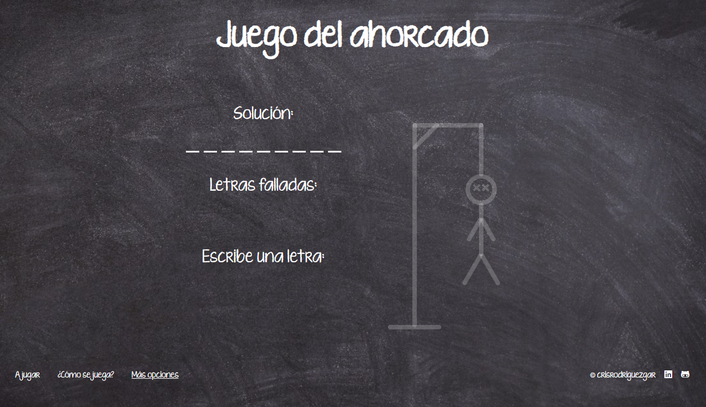

# REACT website: interactive hangman game

This website created by me and my partner Arancha, the user will immerse themselves in a world of words and strategies, where each attempt to guess the hidden word is an opportunity to have fun and improve their linguistic skills. With a friendly and intuitive interface, the hangman game becomes an interactive experience that awakens your curiosity and invites you to participate.

## 🔨 Built with

- **Visual Studio Code**
- **HTML**
- **SASS** 
- **REACT**

## 🐑🐑 Want to clone my repository?

Go for it! And if you make something pretty, please show me.
  
## ✏️ Do you have any idea? 

I'm an student and as I stated before am learning a whole lot of Front End Developing, so, if  you have any idea that I could develope please tell me so and I will try to.

## 🙍‍♀️ Autor

[)](https://github.com/crisrodriguezgar)

[)](https://github.com/ArantzaGG)

## 🏆 Codefactor

### Enjoy it!